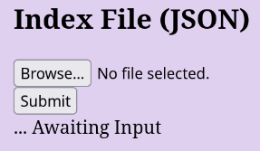
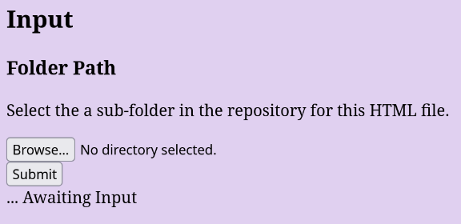
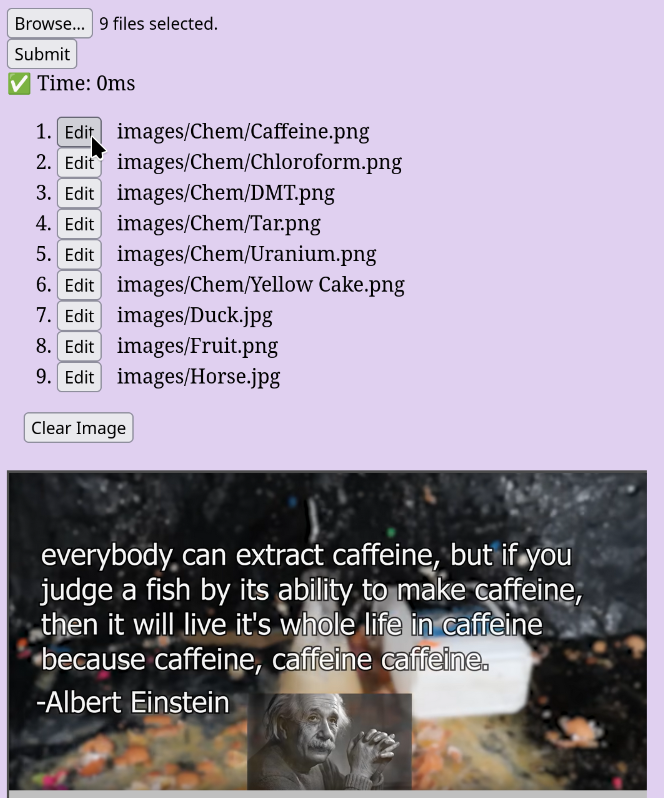
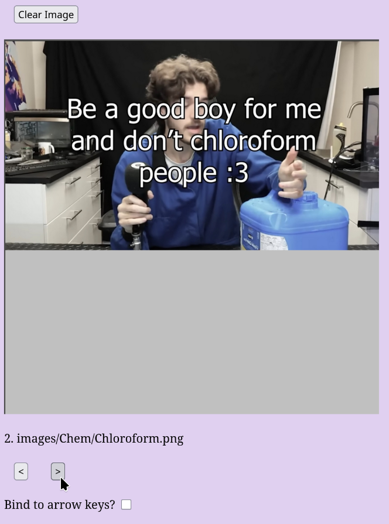
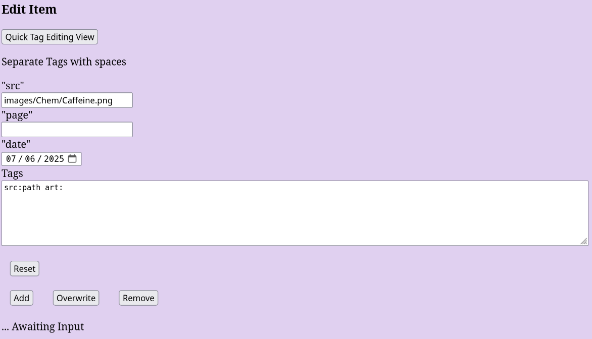
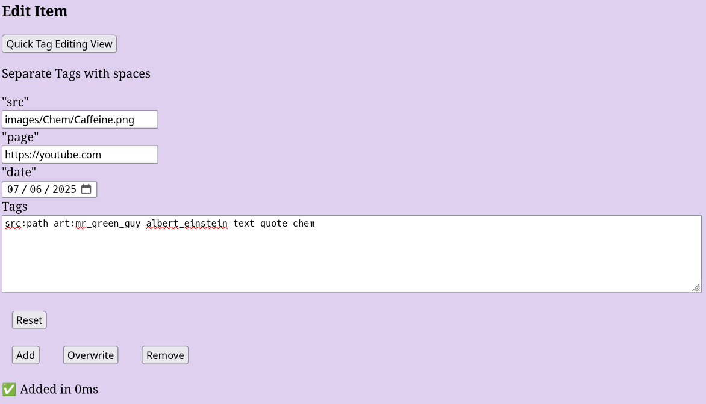
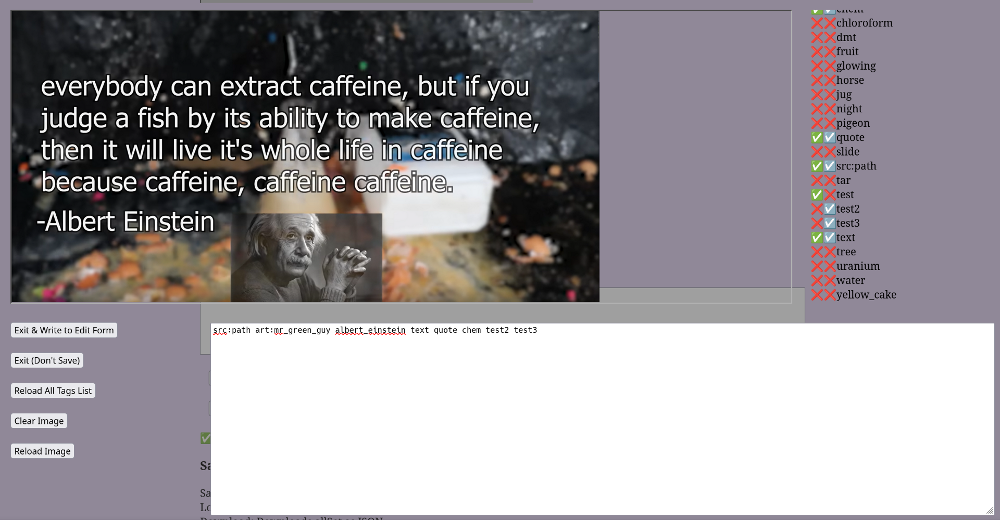
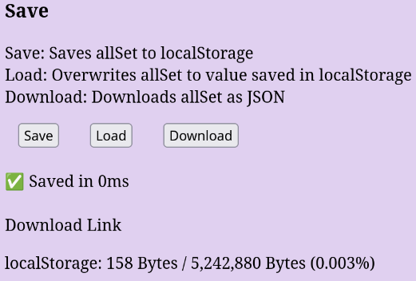
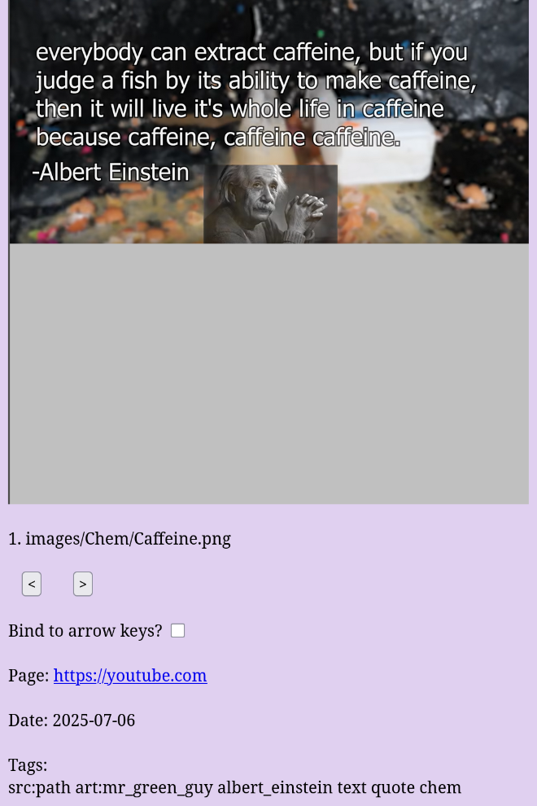

<link href="assets/mdStyle.css" rel="stylesheet"></link>

# Image-Manager

HTML File that accesses/edits a JSON file that tags and organizes images/media.

## File Structure

<pre style="white-space: pre; overflow-x: scroll;">
.
├── assets
│   ├── areFilesLinked.js
│   ├── icon.png
│   ├── main.js
│   └── mainStyle.css
├── <i>images [Example]</i>
├── index.html
├── <i>index.json [Example]</i>
├── LICENSE.md
└── README.md
</pre>

## Instructions

### 1. Move in Media Directory

Copy/Move the directory of media you want to organize in place of the *<code>image</code>* example folder.  

> Next to the <code>index.html</code> file.  

> This step is not necessary if you organizing images hosted on the web. Although, if you are doing this the image may not display on the Input section (only in the Output).  

### 2. Open index.html

Open the <code>index.html</code> file.  

> Any browser should work, but Firefox based browsers seem to have better iframe (media container) UI.  

### 3. Load index.json

If you already have an index file saved, load it:  
  

> *<code>index.json</code>* for example.  

This will *overwrite* <code>allSet</code>.  

> "allSet" is all the tags and data saved to each image/media file.  

### 4. Load Media Directory

Load the sub-directory, *<code>images</code>* for example:  
  

> Warning: Mobile browsers may struggle with large folders.  
> A solution I found was to store all your media in a separate folder (<code>images-all</code>) and have the main folder (<code>images</code>) only be a few files. And when going to search, rename the large folder to the main folder (<code>images-all</code> --> <code>images</code>).  

### 5. Input Navigation

Navigate through the images using the list:  
  

Or use the arrows:  
  

> Checking the "Bind to arrow keys?" will make it so that when you press the left or right arrow keys, it will simulate a press of the respective arrow button.  
> Note: It will trigger *whenever* pressing one of the keys, even when navigating a text box. Which may cause unwanted behavior.  

### 6. Edit Item

Things like the path and date will load from file data:  
  

Update the form inputs to match what you want:  
  

> You can also set the "src" to an URL to the image.  

Press "Add" to add media file's data to <code>allSet</code>, or "Overwrite" to overwrite a media file's data already in <code>allSet</code>.  

You can also remove items, using the "Remove" button.  

### 7. Quick Tag Editing View

This displays a view that may make editing tags faster:  
  

> Loading all the tags takes a bit of time, so you have to press "Reload All Tags List" to display tags.  

All Tags List Key:  
✅ = Tag listed in whats saved in <code>allSet</code>  
☑️ = Tag listed textbox  
❌ = Not listed  

### 8. Saving

Press "Save" to have the browser save <code>allSet</code> (the browser stores this data, and it stores it only to the current domain). Press "Load" to *overwrite* <code>allSet</code> with whats saved:  
  

Press "Download" and click "Download Link" to send you to a JSON file of <code>allSet</code>.  

> **I recommend using the "Download" option often.**  

> Max bytes for <code>localStorage</code> may be incorrect depending on your browser.  

### 9. Search

> <code>outputSet</code> is <code>allSet</code> filtered down to the search parameters.  

How to use the search function is explained on page.  

> If you create a search, and then update the <code>allSet</code> variable, a de-sync may happen. To remedy this, press "Clear Output" and redo the search.  

### 10. Search Navigation

Search navigation is nearly identically to navigating Input Navigation.  

Media info is listed below the media.  

  